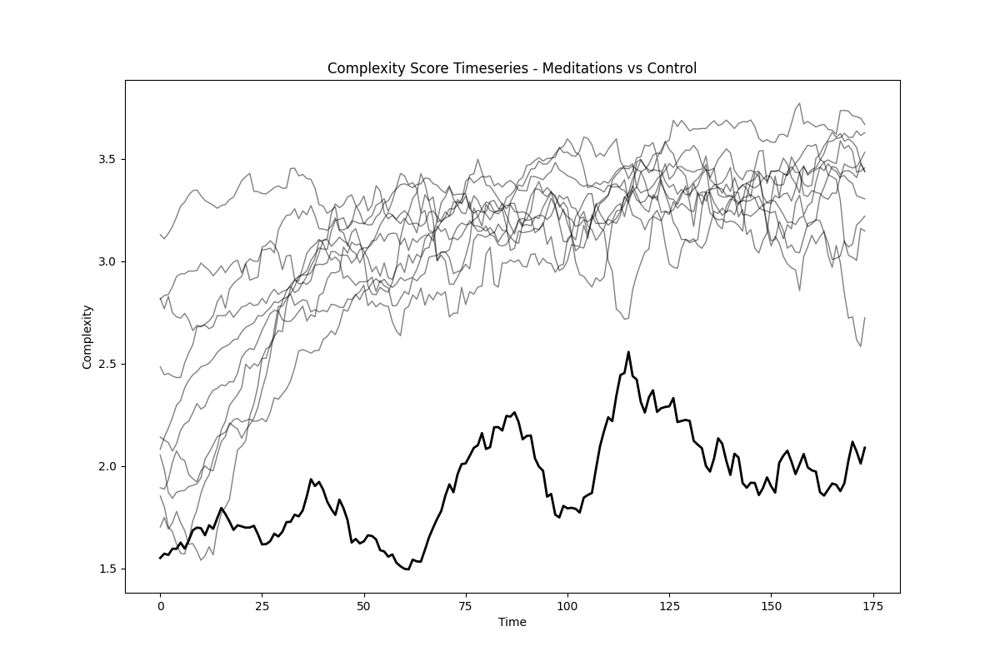
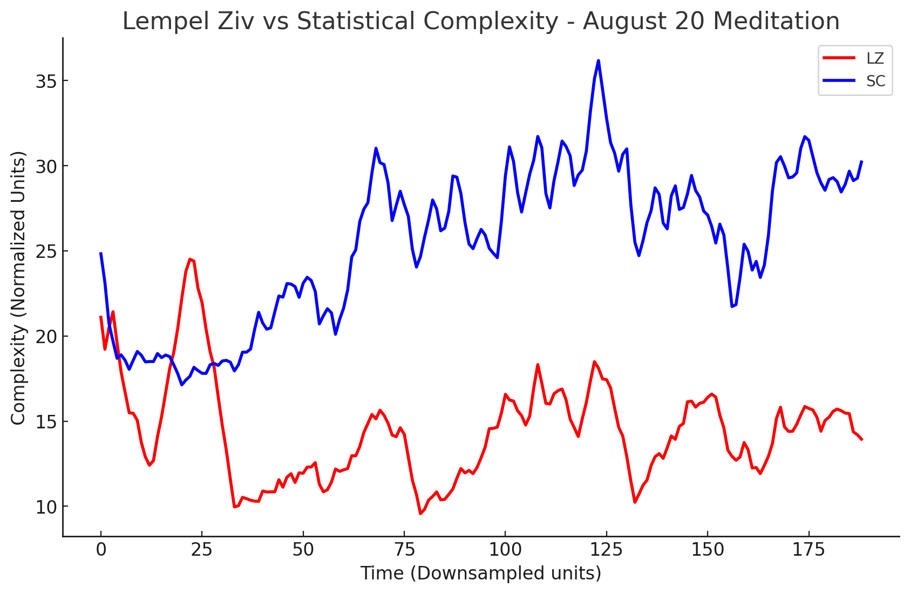
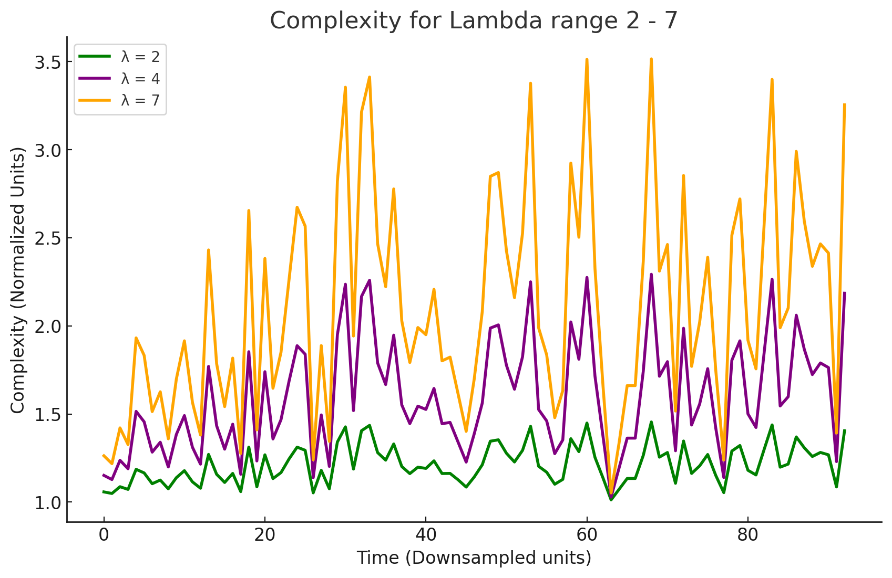

# Statistical Complexity of Insight Meditation

## Overview
This project uses the complexity code published by Starkey et al. [(link)](https://www.vox.com/future-perfect/2023/12/15/24001424/consciousness-complexity-neuroscience-mental-health) applied to EEG recordings provided by the meditation expert Daniel Ingram, author of ["Mastering the Core Teachings of the Buddha"](https://www.mctb.org/) and now with the [EPRC](https://theeprc.org/) working to add spiritual measurements to the DSM.

This new complexity measurement is a proposed improvement over the standard "Lempel Ziv" measurement frequently used in many fields including EEG analysis. Lempel-Ziv (LZ) already does a great job distinguishing different states of consciousness, sleep states, and meditation states. This "Statistical Complexity" (SC) measurement has similar results, but with improved ability to distinguish some states.


- [Study link](https://www.biorxiv.org/content/10.1101/2023.12.05.570101v1)
- [Vox article](https://www.vox.com/future-perfect/2023/12/15/24001424/consciousness-complexity-neuroscience-mental-health)
- [Study code](https://github.com/CDR-Clueless/Statistical-Complexity)
- [Daniel's EEG data](https://osf.io/srfnz/?view_only=1a408d6b96a6402bbf1464418ec3219e)


## Results

Every meditation session Daniel record shows similar complexity behavior: a stead rise at the same rate every session, levelling out at the the same range. Compared with a control session the differences are clear. In the control, Daniel recorded with closed eyes and calm focus but not attempt at insight for the for the first 20 minutes:



This Statistical Complexity scoring is a big improvement over the typical Lempel-Ziv complexity measurement for this meditation data. LZ (red line below) does not show any significant changes over the course of meditation compared with the first few minutes, but SC (blue line) shows behavior consistent with Daniel's reported phenomenology and consistent with what we might expect from meditation: starting off with low complexity, gradually increasing to a new stable state of high complexity:



SC requires a careful choice of Lambda and Sigma values to get the most out of the improved method. Study authors suggest a Lambda value of 5, demonstrating that higher values were better able to distinguish different states of consciousness than lower values, and better able to distinguish these values from LZ complexity. Running this code over the August 20 meditation session with a range of Lambda values from 2 to 7 (chart below) shows that low values show relatively little change in complexity over the meditation (Lambda = 2 actually shows a flat line), while progressively higher values magnifiy the differences considerably. Even higher values increased this magnification, but apparently without much improvement in classification (the shape of the data looked the same, just with higher peaks). The Sigma value range didn't seem to matter very much for this data, so all calculation now just use 0.01.




## Discussion

The SC researchers intend to build "an equation that can measure and describe the richness of conscious experience in any physical system, whether human, animal, or machine". This new measurement does not succeed in this grand ambition, but appears to be on the right track. The ability to reliably distinguish Daniel's basic meditation states is critical to our work helping beginners to distinguish their own meditation progress.


## Code

Complexity is calculated from the raw EEG voltages extracted from .EEG files provided by Daniel here (link at top of this page). Voltage files are large (>200mb), so only one file is provided in this repository as an example, found in the 'Example' folder. Complexity can be calculated from the python file in this same folder:

```bash
python3 calculate_complexity.py 'August 20 - Raw Voltages.csv' 

```

This code plots the complexity for each EEG electrode, then saves a CSV file with the data as 'complexity_scores.csv', which is also included in this folder. The complexity code is verbatim what Starkey et al provided - they thoughtfully included binarizing function which accepts an array of floats, which in this case is simply a 10-second segment of raw EEG data. No modification of the code was necessary to get this working, except to loop over the raw data in 10-second windows and save each result to a new array for plotting and exporting.

Plotting the Meditation vs Control graph is provided in the 'Combined Averages' folder. 'Complexity_with_Control.csv' combines the average complexity score of all EEG locations at each moment into a single average for each meditation session. A 'Control' column at the end does the same for Daniel's control session.

Extracting raw voltages from .EEG files hosted by Daniel can be done with the 'Extract_Raw_Volts.py'. This requires a folder with .EEG and .VHDR files. The extracted CSV will have the raw volts for each EEG sensor, at 500hz sample rate.